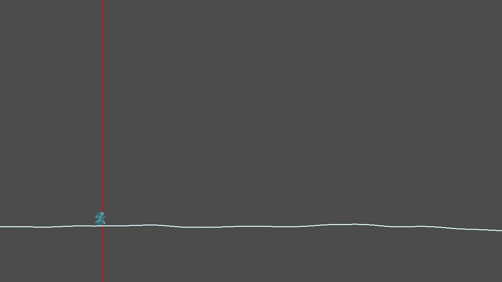
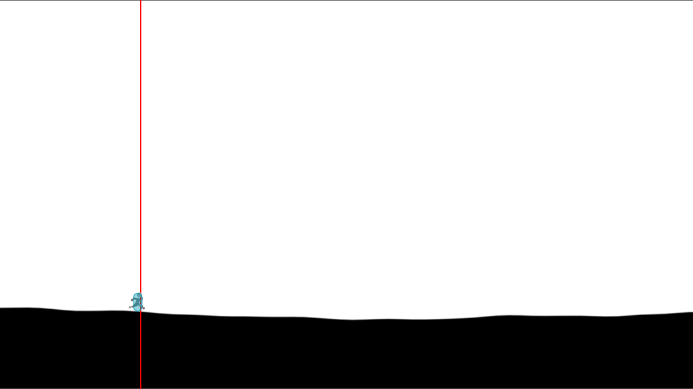
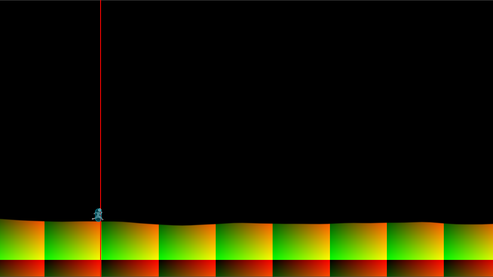
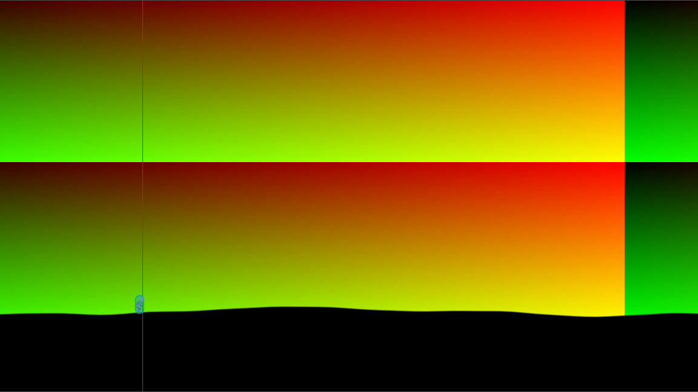
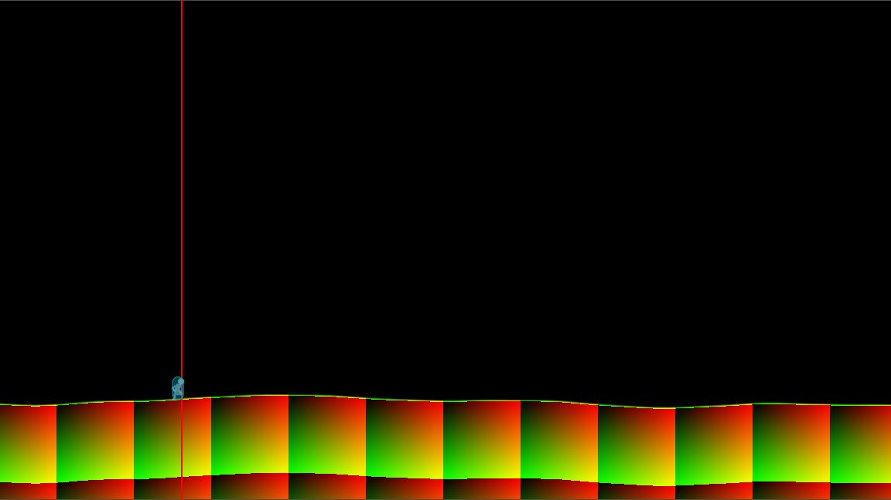
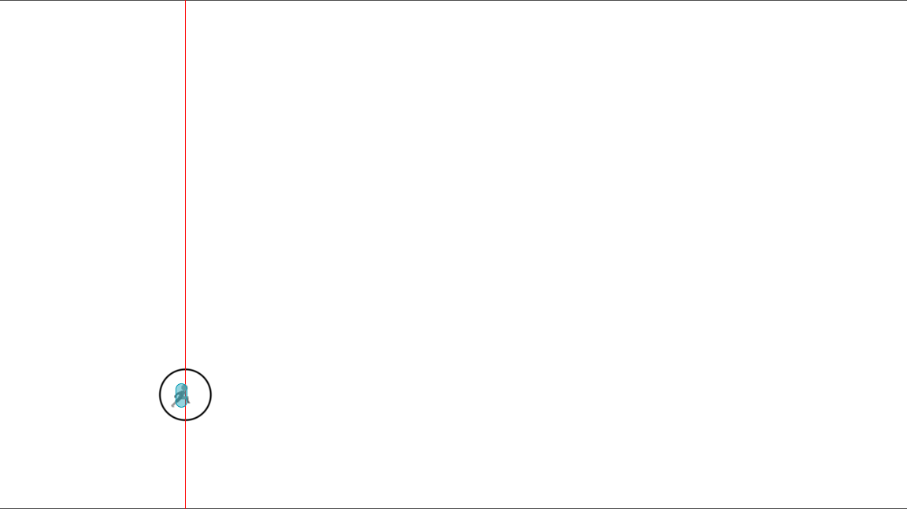

# Probably the worst way to render a 2d game

I'm not going to cover setting up the game part of this - its a player controller, some animations and some physics. The interesting parts are world generation and rendering.

# The world bit:
The obvious (and sensible) way to build an infinite runner is to keep the player "stationary",  move the world towards them, add obstacles procedurally, put it on the apple store and then retire as a millionaire 6 months later. 

This is no fun at all - I insist on making it more difficult and to that end I have set some requirements.
1. i want infinite world
2. i want to turn round, run back the other way and see the world I just ran past

### What's the world?:
It's a line with collision that represents the floor - and eventually some stuff lying around. 

## The problems:
- To support requirement 2 we must be able to reproduce the world at any location. 
- We cannot store the whole world in memory or on disk because infinity is quite big
- Hand authoring an infinitely large world would take ages.

Minecraft has solved all of these problems so we're stealing their ideas...
- Define the world using a seeded noise function
- For drawing, generate the world within a radius of the player and discard it when they move away

## implementation:

Simple enough:

- we seed godot's random number thingy 
- feed a series of horizontal world positions in a radius around the player into get_noise_1d()
- store the horizontal position and result as a vector in an array, 
- generate a line from the stored locations
- generate collision for each line segment
- repeat next frame

    

The total number of points sampled is small enough that we don't need to do anything clever and can just rebuild everything each frame.
At this point (assuming you've set up your player controller and camera) this all just works and you can run forever..

# The rendering bit:
We're rendering the world in a shader assigned to a camera locked quad because I want to. There will be no "why" because it cannot be justified.

Our scene looks something like this at runtime:
- player
- ground line
- camera
    - background quad (what we're rendering to)

Things that happen:
- The player moves in world space
- The camera target is locked to the ground plane below the player

## 1: Rendering the ground :
### Problems:
1. Our shader knows nothing about the scene unless we send the data to it.
2. You can't replicate the same noise function used in game
2. Our ground line is made of hundreds of points and you can't just send hundreds of vectors to a shader every frame. 
3. Our camera is locked to the height of the ground under the player

### Moving the data:
 In the interest of keeping things simple... Our two options for passing data from game to the shader are "something like a uniform" or "texture". We know we can't use uniforms se we're by process of elimination we're using a texture. 

 Every frame, we dump the values generated by the same noise function used to generate line point positions into a texture (*number of points* px by 1px) and send it to the shader. This is a relatively small amount of data so its fast enough.

We sample the generated texture and use that to generate a mask for the ground.\
There are a decent number of "complexities" to this but fundamentally we line the texture up in world space with the ground line and convert it into a 2d representation of the noise.\
At this point we're able to make a distinction between the sky and the earth - this is pretty fundamental if you're trying to render a world so we're in a good place. 

## 2: Colouring things in:

### The world
We could easily set a flat color for the sky and one for the earth and call it a day but we just gave ourselves a headache doing all those sums so we probably ought to go further (and get more headache)

UVs aren't just for mapping textures - if you don't have UVs you don't have a coordinate space and without a coordinate space you can't draw anything more interesting than a flat color.

We get some free UVs with our background quad (we've been using them already) but they only give us a static set of coordinates locked to the background plane - which is boring

So - we generate some UVs here are some .. 
- Ground line locked UVs - can be used to texture the ground\

- Parallax background UVs - multiple layers can be stacked at various distances to give a parallax effect to the background or foreground\

- Ground line locked and vertically warped UVs - can be used to generate a constant thickness line that follows the ground line \

### Other stuff
- We can pass the player position through as a uniform vec2 and transform it into the correct space \ 

